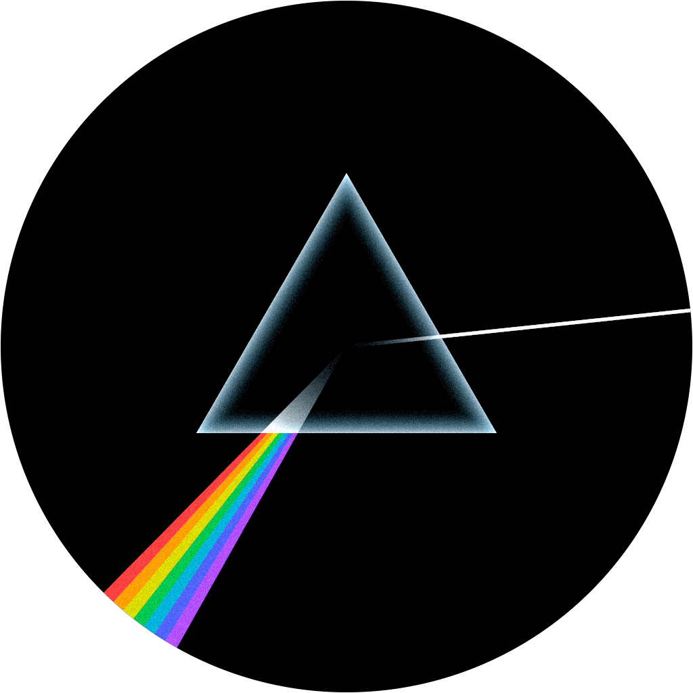

# Ticking Away

> _[Ticking away the moments that make up a dull day.][time-song]_

[time-song]: https://en.wikipedia.org/wiki/Time_(Pink_Floyd_song)



A watchface inspired by Pink Floyd's "Dark Side of the Moon" album cover, featuring a prism that
refracts light into a rainbow.

## Hardware Targets

The primary display is an
**[Inky Impression 13.3" (Spectra 6)](https://shop.pimoroni.com/products/inky-impression?variant=55186435277179)**
e-ink panel in a wall-clock form factor, driven by one of two Raspberry Pi boards:

- **Raspberry Pi Pico 2** — bare-metal embedded target running without an OS. Low power draw makes
  this suitable for battery operation. ([Setup guide](docs/pi-pico-2-setup.md))

- **Raspberry Pi Zero 2 W** — Linux-based target. Easier to get started with but requires wall
  power. ([Setup guide](docs/pi-zero-2-w-setup.md))

- **[Pebble Round 2](https://repebble.com/watch)** — smartwatch (planned)

A [**web demo**](https://clebert.github.io/ticking-away/) is also available, powered by WebAssembly,
for trying different settings and as a quick preview.

## Concept

The minute hand acts as a **light source** firing a white ray toward the watch center. The ray
enters a prism and disperses into a rainbow that targets the **hour hand position**. This creates a
clock where time is displayed through the direction of light rays rather than traditional hands.

## PNG Export

Build and run the PNG export binary to render the watchface to a PNG file:

```bash
zig build png -Doptimize=ReleaseFast
zig-out/bin/png <height> <hour> <minute> <output.png>
```

- `height`: image size in pixels (square, diameter of the unit circle)
- `hour`: hour (0-23)
- `minute`: minute (0-59)
- `output.png`: output file path

```bash
zig build png -Doptimize=ReleaseFast && \
zig-out/bin/png 2234 7 14 prism.png
```

## Disclaimer

This project is built with [Claude Code](https://claude.com/claude-code) (Opus). Every line is
written by hand or at minimum reviewed and curated — no AI slop here.
